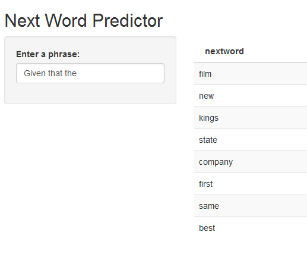

## Introduction

### Wouldn't Be Great If...

You could build a word prediction application customized to your needs?

NextWord is a new word prediction application that allows you to predict your next word based on state of the art prediction algorithms and a flexible system to tune its performance!

---

## Using SwiftKey Data & Natural Language Processing

Behind and intuitive user interface, NextWord uses twitter, blog and news article data provided by SwiftKey.  The configurable build system, samples, processes, analyzes, creates, and evaluates its models.  Using advanced natural language processing techniques such as Modified Kneser-Nye smoothing, NextWord delivers accuracy and blazing fast performance.

---

## Performance Characteristics

<table>
 <thead>
  <tr>
   <th style="text-align:left;"> File Size (Mb) </th>
   <th style="text-align:right;"> NGrams </th>
   <th style="text-align:right;"> Next Word Accuracy % </th>
   <th style="text-align:right;"> In Top 3 Words Accuracy % </th>
   <th style="text-align:right;"> Average Query Time (msec) </th>
  </tr>
 </thead>
<tbody>
  <tr>
   <td style="text-align:left;"> 354.3 </td>
   <td style="text-align:right;"> 35,429,660 </td>
   <td style="text-align:right;"> 18.5 </td>
   <td style="text-align:right;"> 20.8 </td>
   <td style="text-align:right;"> 19.1 </td>
  </tr>
  <tr>
   <td style="text-align:left;"> 323.7 </td>
   <td style="text-align:right;"> 31,296,396 </td>
   <td style="text-align:right;"> 18.4 </td>
   <td style="text-align:right;"> 20.7 </td>
   <td style="text-align:right;"> 19.1 </td>
  </tr>
  <tr>
   <td style="text-align:left;"> 164.8 </td>
   <td style="text-align:right;"> 18,543,372 </td>
   <td style="text-align:right;"> 17.1 </td>
   <td style="text-align:right;"> 19.1 </td>
   <td style="text-align:right;"> 17.3 </td>
  </tr>
  <tr>
   <td style="text-align:left;"> 126.5 </td>
   <td style="text-align:right;"> 13,875,685 </td>
   <td style="text-align:right;"> 17.1 </td>
   <td style="text-align:right;"> 18.9 </td>
   <td style="text-align:right;"> 18.1 </td>
  </tr>
  <tr>
   <td style="text-align:left;"> 65.0 </td>
   <td style="text-align:right;"> 7,290,744 </td>
   <td style="text-align:right;"> 15.6 </td>
   <td style="text-align:right;"> 17.1 </td>
   <td style="text-align:right;"> 19.1 </td>
  </tr>
  <tr>
   <td style="text-align:left;"> 57.8 </td>
   <td style="text-align:right;"> 6,756,321 </td>
   <td style="text-align:right;"> 15.6 </td>
   <td style="text-align:right;"> 17.0 </td>
   <td style="text-align:right;"> 18.6 </td>
  </tr>
  <tr>
   <td style="text-align:left;"> 36.0 </td>
   <td style="text-align:right;"> 3,157,480 </td>
   <td style="text-align:right;"> 15.5 </td>
   <td style="text-align:right;"> 17.1 </td>
   <td style="text-align:right;"> 20.0 </td>
  </tr>
  <tr>
   <td style="text-align:left;"> 28.9 </td>
   <td style="text-align:right;"> 2,623,057 </td>
   <td style="text-align:right;"> 15.5 </td>
   <td style="text-align:right;"> 17.0 </td>
   <td style="text-align:right;"> 17.4 </td>
  </tr>
</tbody>
</table>

---

## More Than Just An Application

There is an entire automated infrastructure of Natural Language Processing ready to tune the prediction model to fit your needs:
 *  Sampling & pre-processing & smoothing
 *  Configurable tuning parameters
 *  Testing and performance reporting
 *  Self documenting model archive
 
 

---

## Make Predicting Your Next Word Fast and Easy!

Shiny Application https://rougeone.shinyapps.io/FlightExplorer

Code Repo:  
https://github.com/wayneheller/developingdataproducts/tree/gh-pages/final_project/FlightExplorer

Pitch Deck https://wayneheller.github.io/FlightExplorerPitch

